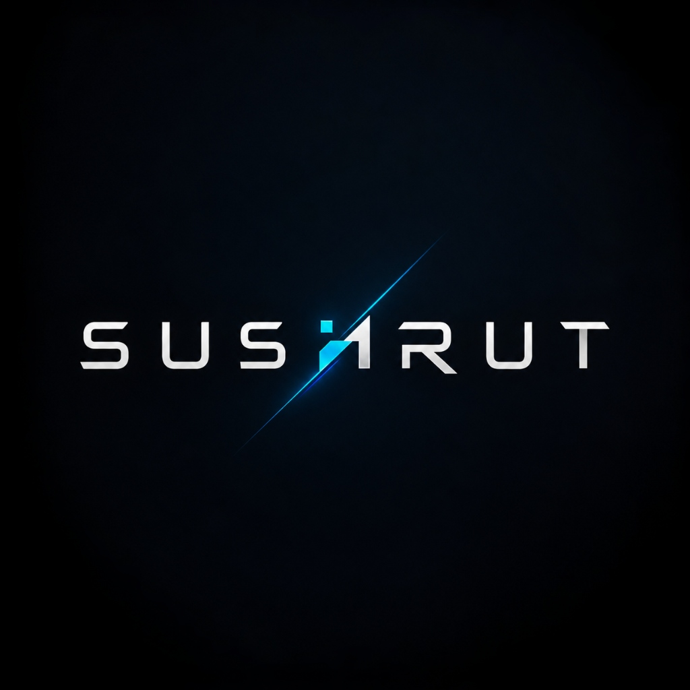

<a name="top"></a>
<div align="center">





<br/>


[](https://github.com/Sushrut-Kale?tab=followers)

<br/>


<br/><br/>

[](https://www.linkedin.com/in/sushrut-kale1367/)
[](mailto:sushrutkale13@gmail.com)
[](https://leetcode.com/u/ryYeqtxZz8/)
[](#)

<br/>

<code>[ <a href="#status">STATUS</a> ]&nbsp;[ <a href="#skilltree">SKILL&nbsp;TREE</a> ]&nbsp;[ <a href="#questlog">QUEST&nbsp;LOG</a> ]&nbsp;[ <a href="#boss">BOSS&nbsp;LEVEL</a> ]&nbsp;[ <a href="#vitals">VITALS</a> ]&nbsp;[ <a href="#achievements">ACHIEVEMENTS</a> ]&nbsp;[ <a href="#leaderboard">LEADERBOARD</a> ]&nbsp;[ <a href="#snake">SNAKE</a> ]&nbsp;[ <a href="#randomdrop">RANDOM&nbsp;DROP</a> ]&nbsp;[ <a href="#checkpoints">CHECKPOINTS</a> ]&nbsp;[ <a href="#continue">CONTINUE?</a> ]</code>

<br/><br/>


</div>

<a name="status"></a>
## `[ 🎮 PLAYER STATUS ]`

<div align="center">

</div>

```
══════════════════════════════════════════════════════
  PLAYER   Sushrut Kale
  CLASS    AI/ML Engineer × Full-Stack × 3D Dev
  LEVEL    2nd Year — CSE (AI/ML)
  GUILD    MIT Academy of Engineering, Pune
  POWER    8.9 CGPA
══════════════════════════════════════════════════════
```

`XP TO NEXT LEVEL` &nbsp; 🔥

```yaml
active_quest:   "EduCore — role-based classroom collaboration platform"
grinding:       ["LLM fine-tuning", "distributed systems", "3D engines"]
guild_status:   "🟢 OPEN — hackathons, AI/ML collabs, open source"
```

<div align="right"><a href="#top"><sub>▲ back to top</sub></a></div>

<!-- ═══════════ ANIMATED DIVIDER — Glitch/Cyber Line ═══════════ -->
<div align="center">


</div>

---

<a name="skilltree"></a>
## `[ 🌳 SKILL TREE ]`

<div align="center">

</div>

<br/>

<div align="center">

`Python` &nbsp;
<br/>
`Optimization (OR-Tools / CP-SAT)` &nbsp;
<br/>
`3D Engines (Three.js / R3F)` &nbsp;
<br/>
`React / Next.js` &nbsp;
<br/>
`JavaScript / TypeScript` &nbsp;
<br/>
`Game Systems (pathfinding, camera, controls)` &nbsp;
<br/>
`AI/ML (Gemini API, applied ML)` &nbsp;

</div>

<table>
<tr><td width="50%" valign="top">

**⚡ Unlocked — Core & Optimization**
```
python        3.10+  ML tooling, general use
javascript/ts ES2022 frontend logic
or-tools      CP-SAT constraint solving
manim         CE     mathematical animation
sql           —      relational queries
```

</td><td width="50%" valign="top">

**⚡ Unlocked — Engine & Backend**
```
three.js/r3f  —      real-time 3D rendering
zustand       —      hook-based state mgmt
fuse.js       —      fuzzy search indexing
node/fastapi  —      REST + async ML APIs
mongodb/fb    —      document store, auth
```

</td></tr>
</table>

<br/>

**📦 Full inventory (item-by-item drop table)**

| category | loot |
|---|---|
| **languages** |     |
| **ai / ml** |    |
| **optimization** |  `CP-SAT · constraint solving` |
| **frontend / 3d** |      |
| **backend** |     |
| **databases** |   |
| **devops / cloud** |     |
| **other** |   |

<div align="right"><a href="#top"><sub>▲ back to top</sub></a></div>

<!-- ═══════════ ANIMATED DIVIDER — Waving Neon ═══════════ -->
<div align="center">

</div>

<!-- ═══════════ ANIMATED TYPING — Pre–Quest Loading ═══════════ -->
<div align="center">

</div>

<a name="questlog"></a>
## `[ 📜 QUEST LOG ]`

| quest | type | difficulty | reward (stack) | status |
|---|---|---|---|---|
| **Learner-State Engine** | Main Quest | ★★★★★ | Python · FastAPI · React · MongoDB · Gemini | 🟡 `ONGOING` |
| **Campus Twin** | Boss Level | ★★★★★ | React · Three.js · R3F · Zustand · Fuse.js | ✅ `CLEARED` |
| **CampusCompass** | Main Quest | ★★★★☆ | Next.js 16 · FastAPI · OR-Tools | ✅ `CLEARED` |
| **ClubSync** | Main Quest | ★★★☆☆ | React · Node.js · MongoDB · Firebase · Gemini | 🟢 [`LIVE`](https://clubsync-4qua.vercel.app/) |
| **EduCore** | Side Quest | ★★★☆☆ | React · Vite · Firebase · Tailwind | 🟢 [`LIVE`](https://edu-core-blush.vercel.app/) |
| **IntelliForge** | Side Quest | ★★★☆☆ | JavaScript | 🟣 [`REPO`](https://github.com/Sushrut-Kale/intelliforge) |
| **Manim Showcase** | Side Quest | ★★★☆☆ | Python · Manim CE · NumPy | ✅ `CLEARED` |
| **TradeVision 2030** | Side Quest | ★★☆☆☆ | Power BI · DAX · Snowflake Schema | ✅ `CLEARED` |

<details>
<summary><b>▸ Quest Log Entry — Learner-State Engine</b></summary>
<br>

A closed-loop personal learning agent. Keeps a **live, per-topic Bayesian mastery model (BKT)** for each learner and continuously **re-plans their study path via CP-SAT** the moment that model changes — every decision driven by verified mastery, never a proxy like "video watched." A transparent, rule-based risk engine (never an LLM call) can shrink tasks or trigger nudges when pace drops; every automated decision is logged to an append-only trace.

`Python` `FastAPI` `React` `MongoDB` `Gemini API` `Ollama (offline fallback)`

</details>

<details>
<summary><b>▸ Quest Log Entry — CampusCompass</b></summary>
<br>

Automated timetable generator for MIT Academy of Engineering. A coordinator uploads a Faculty/Rooms/Time Excel workbook; a **CP-SAT constraint solver** (Google OR-Tools) generates a conflict-free weekly schedule, browsable by faculty, room, and division. Deliberately zero-database on the solver side — persistence lives entirely in the Next.js layer.

`Next.js 16` `FastAPI` `OR-Tools`

</details>

<details>
<summary><b>▸ Quest Log Entry — ClubSync</b></summary>
<br>

AI-powered college club management platform — role-based access (Admin / Club Head / Student), QR-code attendance, real-time notifications, and **Gemini-powered club recommendations**.

[](https://clubsync-4qua.vercel.app/)

`React` `Node.js` `MongoDB` `Firebase` `Gemini API`

</details>

<div align="right"><a href="#top"><sub>▲ back to top</sub></a></div>

<!-- ═══════════ ANIMATED DIVIDER — Soft Cylinder ═══════════ -->
<div align="center">

</div>

---

<a name="boss"></a>
## `[ 👹 BOSS LEVEL ]` — Campus Twin

<div align="center">

### 🌐 3D Interactive Campus Navigator


</div>

An interactive, WebGL-powered **3D digital twin** of the MIT AOE campus. Built with **React Three Fiber**, it renders the full campus mesh, resolves shortest paths in real time, and drops you into a first-person walkthrough of your own department.

<table>
<tr><td width="50%" valign="top">

**🕹️ Dual Navigation Modes**
- Orbit Mode — bird's-eye pan/rotate/zoom
- Explore (FPS) Mode — WASD/arrow-key movement, plus a touch joystick for mobile

**📍 Pathfinding & Route Animation**
- Localized **A\* search** between any two campus waypoints
- Route drawn as a glowing, pulsing neon-red 3D tube (`CatmullRomCurve3`)
- "Follow Route" camera-ride with pause/play + 0.5×–3.0× speed control

</td><td width="50%" valign="top">

**🔍 Fuzzy Search**
- **Fuse.js**-powered instant search across rooms, wings, and faculty

**🏢 Interactive Info Panels**
- Click/hover a building mesh → room capacities, amenities, faculty profiles

**⚙️ WebGL Resiliency**
- Recovers gracefully from context loss (e.g. mobile tab backgrounding) without a black-screen freeze

</td></tr>
</table>

```yaml
frontend:   React 18 (SPA)
rendering:  three.js via @react-three/fiber + @react-three/drei
state:      Zustand
search:     Fuse.js
styling:    dark glassmorphic UI, custom CSS
build:      Vite
deploy:     Vercel (SPA rewrite config included)
```

<div align="center">
<a href="#"></a>
<a href="https://github.com/Sushrut-Kale/mitaoe3d"></a>
</div>

<sub>⚠️ No live link was given for this one — swap in your deployed URL or say "repo only".</sub>

<div align="right"><a href="#top"><sub>▲ back to top</sub></a></div>

<!-- ═══════════ ANIMATED DIVIDER — Neon Triple Line ═══════════ -->
<div align="center">


</div>

---

<a name="vitals"></a>
## `[ 🧬 VITALS ]`

<div align="center">

</div>

```
COFFEE LEVEL     ████████████████████░░  92%   [ CRITICAL — DO NOT INTERRUPT ]
DEBUG RAGE       ██████████░░░░░░░░░░░░  45%   [ stable, mostly console.log ]
SLEEP DEBT       ██████████████████░░░░  81%   [ compounding interest ]
MOTIVATION       ████████████████████████ 99%   [ overclocked ]
STACK OVERFLOW   ██████████████░░░░░░░░  63%   [ tabs open: unknown ]
```

<div align="center"><sub>⚠️ vitals are flavor text, not a cry for help — read the README, not the vibes</sub></div>

<div align="right"><a href="#top"><sub>▲ back to top</sub></a></div>

<!-- ═══════════ ANIMATED DIVIDER — Soft Wave ═══════════ -->
<div align="center">

</div>

---

<a name="achievements"></a>
## `[ 🏅 ACHIEVEMENTS UNLOCKED ]`

<div align="center">


<br/>


</div>

<div align="right"><a href="#top"><sub>▲ back to top</sub></a></div>

<!-- ═══════════ ANIMATED DIVIDER — Shark Tooth ═══════════ -->
<div align="center">

</div>

---

<a name="leaderboard"></a>
## `[ 🏆 LEADERBOARD ]`

<!-- ═══════════ ANIMATED TYPING — Stats Loading ═══════════ -->
<div align="center">

</div>

<br/>

<div align="center">

**Player Card**


**Core Stats**


**Streak**


**Productive Time**


</div>

<div align="right"><a href="#top"><sub>▲ back to top</sub></a></div>

<!-- ═══════════ ANIMATED DIVIDER — Waving Neon (variant) ═══════════ -->
<div align="center">

</div>

---

<a name="snake"></a>
## `[ 🐍 CONTRIBUTION SNAKE ]`

<div align="center">
<picture>
  <source media="(prefers-color-scheme: dark)" srcset="https://raw.githubusercontent.com/Sushrut-Kale/Sushrut-Kale/output/github-contribution-grid-snake-dark.svg"/>
  <source media="(prefers-color-scheme: light)" srcset="https://raw.githubusercontent.com/Sushrut-Kale/Sushrut-Kale/output/github-contribution-grid-snake.svg"/>
  
</picture>
</div>

<div align="center"><sub>⚙️ powered by a GitHub Action (<code>snake.yml</code>) that redraws itself daily from your real contribution graph</sub></div>

<div align="right"><a href="#top"><sub>▲ back to top</sub></a></div>

<!-- ═══════════ ANIMATED DIVIDER — Cylinder Neon ═══════════ -->
<div align="center">

</div>

---

<a name="randomdrop"></a>
## `[ 🎲 RANDOM DROP ]`

<div align="center">
<sub>refreshes on every page load — a wild dev joke and quote appear</sub>
<br/><br/>

<br/><br/>

</div>

<div align="right"><a href="#top"><sub>▲ back to top</sub></a></div>

<!-- ═══════════ ANIMATED DIVIDER — Venom Variant ═══════════ -->
<div align="center">

</div>

---

<a name="checkpoints"></a>
## `[ 💾 CHECKPOINT LOG ]`

```
CHECKPOINT 1  (2024)  loss=high        SDG-lab project, Power BI basics
CHECKPOINT 2  (2025)  loss=decreasing  ClubSync + EduCore shipped, VELORA 2026
CHECKPOINT 3  (2025)  loss=decreasing  CampusCompass — first solver in production
CHECKPOINT 4  (2026)  loss=converging  Campus Twin — first real-time 3D engine build
CHECKPOINT 5  (2026)  loss=converging  Learner-State Engine — BKT + CP-SAT closed loop
CHECKPOINT 6  (now)   loss=?           grinding: LLM fine-tuning, distributed systems

>>> save file not yet complete. game continues.
```

<div align="center">

</div>

<div align="right"><a href="#top"><sub>▲ back to top</sub></a></div>

---

<!-- ═══════════ ANIMATED SECTION — Currently Grinding ═══════════ -->
<a name="grinding"></a>
## `[ 🔊 NOW PLAYING ]`

<div align="center">


<br/>

<!-- Animated "equalizer bars" via shields.io — a visual heartbeat -->


</div>

<div align="right"><a href="#top"><sub>▲ back to top</sub></a></div>

<!-- ═══════════ ANIMATED DIVIDER — Waving Neon (bottom) ═══════════ -->
<div align="center">

</div>

---

<a name="continue"></a>
## `[ 🕹️ CONTINUE? ]`

```json
{
  "linkedin":  "linkedin.com/in/sushrut-kale1367",
  "email":     "sushrutkale13@gmail.com",
  "portfolio": "ADD_YOUR_PORTFOLIO_URL_HERE",
  "guild_open_to": ["hackathons", "AI/ML collabs", "game dev / 3D projects", "open source"],
  "status":    "PRESS START"
}
```

<div align="center">

[](https://www.linkedin.com/in/sushrut-kale1367/)
[](mailto:sushrutkale13@gmail.com)
[](#)

<br/>


</div>

<!--
========================================================
SETUP NOTES — read before pushing (delete once done)
========================================================

1) REPO LOCATION (required for every live widget):
   This file must be README.md in a public repo named EXACTLY
   Sushrut-Kale/Sushrut-Kale.

2) THINGS I NEEDED FROM YOU AND GUESSED/PLACEHELD:
   - Pin/repo slugs: confirmed live pins are "intelliforge",
     "portfolio", "manim" (github.com/Sushrut-Kale?tab=repositories).
     Kept "mitaoe3d" for Campus Twin from your prior doc — confirm
     it matches your actual repo name.
   - Campus Twin live demo link: still a placeholder badge under
     [ BOSS LEVEL ] — send the URL or say "repo only" and I'll
     drop the live badge entirely.
   - Portfolio link: replace every "#" / "ADD_YOUR_PORTFOLIO_
     URL_HERE" (3 spots: top badges, continue() JSON, continue
     badges).

3) WHAT GOT CRANKED UP FOR "OVER HYPED":
   - Waving gradient header (multi-stop pink→purple→blue) instead
     of flat venom banner, with twinkle animation.
   - Multi-line looping typing SVG intro + a second typing SVG
     under STATUS for a "boot sequence" feel.
   - Added a GitHub Activity Graph (react-dark theme) to the
     Leaderboard section — new widget not in the original.
   - Rainbow animated divider lines under the header and above
     Checkpoints.
   - Slice-gradient mini divider under the Boss Level heading.
   - Follower-count badge next to the visitor counter.
   - Emoji section markers (🎮 📜 👹 🏆 💾 🕹️) for faster scanning.
   - Added IntelliForge (confirmed real pinned repo) to the Quest
     Log, since it wasn't in your previous draft.

4) SNAKE SETUP — this is the ONLY piece that needs manual work:
   a. The workflow file is now at .github/workflows/snake.yml
      (previously it was in the repo root, which GitHub ignores).
   b. Go to the repo's Settings → Actions → General → Workflow
      permissions, and set it to "Read and write permissions"
      (the action needs this to push the generated SVG to an
      "output" branch it creates automatically).
   c. Go to the Actions tab → "generate contribution snake" →
      "Run workflow" to trigger it once by hand instead of
      waiting for the daily midnight cron.
   d. After it runs successfully, the output branch will exist
      and both image URLs in the README will resolve instead
      of 404ing. It then re-runs automatically every day.

5) FIXED: the joke card's colors weren't taking effect because
   the hex values need to be URL-encoded with %23 in place of
   the # symbol (?bgColor=%230d0221 etc.) — passing them as raw
   hex silently fails and the card falls back to unreadable
   default text. It should now show cyan question / pink answer
   text on a dark navy card exactly like the rest of the page.

6) OPTIONAL EXTRAS NOT ADDED (ask if you want them):
   - 3D contribution terrain
   - A live "now playing" Spotify widget (needs Spotify OAuth)
   - A "buy me a coffee" support badge

7) FONT NOTE:
   The header typing animation uses "Press Start 2P" (retro
   arcade font) — it's a Google Font pulled automatically by the
   typing-svg service, no install needed on your end.
========================================================
-->
